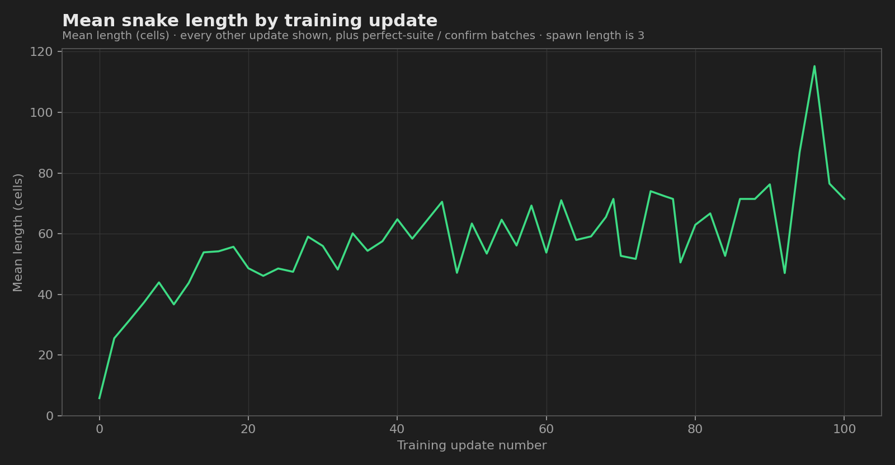
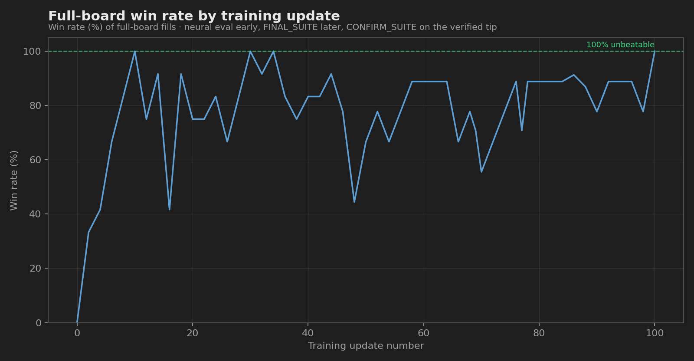

# Snake Deep-RL Bot

A size-invariant deep neural Snake agent. The packaged network
(`models/snake_bot.pt`) chooses every move itself — turn left, go straight, or
turn right — with **no search fallback** and **no covering-cycle guard** at
action time.

It was trained from a blank net (random orthogonal weights) by behavioral
cloning / DAgger against a strong teacher, then verified on a fixed mixed-size
suite. The same weights play 5×5, 10×10, 12×12, 15×10, and the other boards in
the suite without changing the architecture.

## Quick start

```bash
python3 -m pip install -r requirements.txt

# Watch the neural net in the browser
python3 -m snake watch

# Play in the terminal (neural only)
python3 -m snake play --mode neural --width 12 --height 12

# Evaluate the network across many sizes
python3 -m snake eval --mode neural --games 10

# Record GIFs (including the untrained net)
python3 -m pip install pillow
python3 -m snake record
python3 -m snake record --style untrained
```

Open [`animations/index.html`](animations/index.html) for gallery GIFs on 5×5
through 20×12 (Google Snake look). Training curves live in
[`graphs/`](graphs/) (regenerate with `python3 -m snake plot`).

## Results (neural net only)

The unwrapped network — `SnakeBot(mode="neural")`, which is just
`model.act(...)` on the egocentric observation — fills every board in the
fixed verification suites:

| Suite | Boards | Result |
|-------|--------|--------|
| `FINAL_SUITE` | 9 fixed sizes/seeds (5×5 … 12×12) | **9/9** full-board wins |
| `CONFIRM_SUITE` | 23 fixed sizes/seeds (adds 11×11, 15×10, …) | **23/23** full-board wins |

A “win” means length = width × height (the snake occupies every cell). Those
checks do **not** call a search solver at decision time.

Training progress (clone / DAgger iterations in `models/win_curve.json`):

| Metric | Start | Verified tip |
|--------|-------|--------------|
| Mean snake length | ~6 | ~71 (suite mean) |
| Full-board win rate | 0% | **100%** (confirm suite) |





Untrained look (same board sizes as the gallery): see
[`animations/untrained/`](animations/untrained/) or run
`python3 -m snake record --style untrained`.

## Controls and rewards

Relative actions keep the policy independent of facing:

| Action | Meaning           |
|--------|-------------------|
| 0      | turn left         |
| 1      | continue straight |
| 2      | turn right        |

A 180° turn is impossible in one step, so the net cannot reverse into its neck.

| Event                        | Reward |
|------------------------------|--------|
| Eat food (snake gets longer) | **+1** |
| Die (wall, self, or starve)  | **-1** |
| Fill every cell on the board | **+5** bonus on top of the last +1 |

## Why the same network plays any board size

1. **Egocentric 11×11 window** — cropped around the head and rotated so the
   snake always faces “up”. Body, food, and walls are three channels.
2. **Normalized scalars** — food bearing, length / area, danger flags, and
   covering-cycle hints (distance-to-food along the cycle, per-action
   leftovers). Values stay in a stable range across widths and heights.
3. **Fixed-size CNN trunk** on that 11×11 crop, so the MLP head has a constant
   width.

```
11×11×3  ──►  Conv 32 → 64 → 64 (stride 2)  ──►  6×6×64
27 scalars ────────────────────────────────────────────► concat → MLP → π(a|s), V(s)
```

Training and cloning mix board sizes every episode so the policy cannot overfit
one rectangle.

## Train / improve the network

From a blank net (writes `models/untrained.pt`, then PPO):

```bash
python3 -m snake train --total-steps 1500000
```

Clone until the **unwrapped** network wins the mixed-size suite (logs
`models/win_curve.json`):

```bash
python3 -m snake wins
```

```bash
python3 -m unittest tests.test_snake -v
```

## Project layout

```
snake/
  env.py        Classic Snake, size-invariant observations
  model.py      Actor-critic network
  ppo.py        PPO + GAE
  train.py      From-scratch PPO on a mix of board sizes
  win_train.py  Clone / DAgger until unwrapped neural suite is 100%
  bot.py        Inference: neural (network only) | hybrid | perfect | random
  record.py     GIF recorder
  web.py        Browser watcher
  play.py       Terminal viewer
  evaluate.py   Multi-size report
models/
  untrained.pt      Random weights
  snake_bot.pt      Trained neural checkpoint (verified suite-perfect)
  snake_bot_best.pt Best suite checkpoint
  win_curve.json    Wins / length vs training iteration
graphs/
  mean_length_over_time.png
  win_rate_over_time.png
animations/
  index.html        Gallery
  untrained/        Blank-net GIFs
  fast/ · rail/     Reference GIFs
tests/
  test_snake.py
```

## Design notes

- **No gym / pygame dependency.** Torch + numpy train and play; the watcher is
  the stdlib HTTP server; GIFs use Pillow.
- **Win condition** is length = width × height.
- **`--mode neural` is network-only.** Action selection is the trained
  policy’s argmax over left / straight / right. It does not run a search or
  replace moves with a solver. Cycle-related values appear only as input
  features the net was trained to read.
