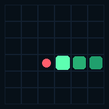
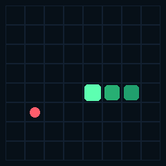
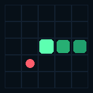

# Snake Deep-RL Bot

A size-invariant deep-learning Snake agent, trained from scratch with
reinforcement learning, plus a theoretically complete never-die policy that
works on **any board size**.

The packaged bot (`models/snake_bot.pt`) starts as a randomly initialized
network that only knows the three controls — turn left, go straight, turn
right. It is rewarded when it gets longer and punished when it dies. After
training, the same weights play 6×6, 10×10, 16×12, or any other grid without
changing the architecture.

The **browser watcher and `--mode perfect` never die** and always fill the
board. Neural / hybrid still *propose* a network move, but any disagreement
with the covering-cycle policy is replaced, so a bad output cannot walk into
a wall or the snake’s body.

## Quick start

```bash
python3 -m pip install -r requirements.txt

# Browser board — pick size, press Play (always-win by default)
python3 -m snake watch

# Record rail vs fast GIFs for every board size (needs Pillow)
python3 -m pip install pillow
python3 -m snake record

# Terminal viewer (never-die covering cycle)
python3 -m snake play --mode perfect --width 12 --height 12
```

Open `animations/index.html` for rail vs fast games on 5×5 through 20×12.

Train from a blank network (writes `models/untrained.pt` first, then the bot):

```bash
python3 -m snake train --total-steps 1500000
```

Clone the never-die policy and append mixed-size wins to `models/win_curve.json`:

```bash
python3 -m snake wins
```

Evaluate across many sizes:

```bash
python3 -m snake eval --mode perfect --games 5
python3 -m snake eval --mode neural --games 10
python3 -m snake eval --mode hybrid --games 10
```

`eval` / `play` use the same `SnakeBot` guard as the watcher for
`perfect` / `neural` / `hybrid`. `--mode random` can die; the watcher does not
offer it.

## Controls and rewards

The agent never issues absolute WASD. Relative actions keep the policy
independent of facing:

| Action | Meaning           |
|--------|-------------------|
| 0      | turn left         |
| 1      | continue straight |
| 2      | turn right        |

A 180° turn is physically impossible, so the network cannot reverse into its
neck in one step.

Reward (this is the entire learning signal):

| Event                        | Reward |
|------------------------------|--------|
| Eat food (snake gets longer) | **+1** |
| Die (wall, self, or starve)  | **-1** |
| Fill every cell on the board | **+5** bonus on top of the last +1 |

Starvation (too many steps without food) is treated as death so a looping
policy cannot farm 0 reward forever. The perfect solver, the watcher, and
GIF recording disable that timeout, because following a Hamiltonian cycle is
allowed to wait for food.

## Why the same network plays any board size

A CNN over a raw 20×20 grid cannot be dropped onto a 7×9 grid. This agent
never sees a fixed-size board.

1. **Egocentric 11×11 window** — the board is cropped around the head and
   rotated so the snake always faces “up”. Walls, body, and food are three
   channels. Translation, rotation, and board size all disappear from the
   image.
2. **Normalized scalars** — food bearing, Manhattan distance / (w+h),
   length / area, idle fraction, and immediate danger on left/straight/right.
   Every value is in `[0, 1]` regardless of width and height.
3. **Fixed-size CNN trunk** on that 11×11 crop (stride-2 downsample to 6×6),
   so the fully-connected layers have a constant width.

The actor-critic is a small ConvNet + MLP (PPO). At initialization the
weights are orthogonal-random: it can output left/straight/right, and
nothing else.

```
11×11×3  ──►  Conv 32 → 64 → 64 (stride 2)  ──►  6×6×64
13 scalars ────────────────────────────────────────────► concat → MLP → π(a|s), V(s)
```

Training samples a mix of sizes every episode (6×6, 7×7, 8×8, 10×10, 12×12,
…), so the policy cannot overfit one rectangle.

## Theoretically perfect play

Snake on a grid is a graph problem.

- If **at least one dimension is even**, the grid has a Hamiltonian cycle.
  Following that cycle visits every cell, so the snake never hits itself or a
  wall and eventually eats every apple. By default it still **never dies**,
  but it takes a shortcut whenever a neighboring cycle cell is closer to food
  *and* the cycle path from that cell to the tail is empty. That is the same
  guarantee as riding the rail, with about 25–40% fewer steps. Pass
  `PerfectBot(hunt=False)` or `python3 -m snake record --style rail` to see
  the repeating lap.
- If **both dimensions are odd**, a Hamiltonian cycle of all N cells cannot
  exist (grid graphs are bipartite and N is odd). The solver builds a cycle
  through **N−1** cells and treats the opposite corner as a spur. That cell is
  entered only to eat, or to take the last square and fill the board, and only
  when the snake can still leave.

`--mode perfect` is this policy. It has no learned weights. It filled every
tested board (5×5 through 20×12, odd and even) without dying.

### From rail to fast

The first never-die bot only **rode the rail**: at every step it moved to the
next cell on that covering cycle (`PerfectBot(hunt=False)`). That always
fills the board, but the snake traces the same serpentine whether food is
adjacent or a full lap away.

The next idea — grid-shortest path to food whenever the tail was still
reachable — *looks* like a hunter and dies. Leaving the cycle can pocket the
head so the Hamiltonian follow-up is gone; unconstrained BFS was the source of
the old wall / self collisions.

**Fast** (`hunt=True`, the default) still only steps onto the covering cycle.
Among left / straight / right it may jump to a neighboring cycle cell that is
closer to food *along the cycle*, and only if two extra checks hold:

1. After the move, walking the cycle from the new head hits the **tail
   before any other body cell** (the skipped region is empty).
2. There is still more empty cycle in front of the head than the snake is
   long (`room > length`), so riding the rail after the jump cannot catch the
   body.

If no neighbor passes those checks, it takes the next rail cell, same as
before. Shortcuts therefore cannot stack into a trap: every hunt leaves a
legal rail ride to the tail. Grid BFS is never the first choice.

Same seed (7), left = rail, right = fast:

**6×6** — 269 steps → 217 (the snake still weaves, but cuts a column early
when food is ahead on the cycle).

| Rail | Fast |
|------|------|
|  |  |

**8×8** — 1031 steps → 677.

| Rail | Fast |
|------|------|
|  |  |

**5×5** (odd board: cycle through 24 cells, last corner is a spur) — 166
steps → 130.

| Rail | Fast |
|------|------|
|  |  |

Every other recorded size is in [`animations/index.html`](animations/index.html)
(`python3 -m snake record` rebuilds them).

The packaged `SnakeBot` uses this fast policy as a **guard**. `neural` and
`hybrid` may propose a hunt; if that move is not the covering-cycle action,
it is replaced. Unwrapped network play (no guard) is what `python3 -m snake
wins` reports as “neural wins” — that clone has not yet filled mixed-size
boards on its own.

## Results

Trained from random weights for 1.5 million steps on a mix of board sizes
(Apple GPU / MPS, ~2k–6k environment steps per second). The untrained net
averaged length **3.2**. After PPO:

| Board | Neural mean length | Fill | Max | Notes |
|-------|--------------------|------|-----|-------|
| 6×6   | 29.3 / 36          | 81%  | 35  | Eval win rate during training reached 37.5% |
| 8×8   | 51.8 / 64          | 81%  | **64** | Full-board win in 1/8 games |
| 7×7   | 36.9 / 49          | 75%  | 46  | Odd×odd, same weights |
| 5×8   | 33.0 / 40          | 83%  | 38  | Size not overfitted |
| 10×10 | 64.0 / 100         | 64%  | 82  | |
| 12×12 | 69.9 / 144         | 49%  | 94  | |

The never-die covering cycle is **100% wins** on mixed sizes (8/8 every
clone-training eval in `models/win_curve.json`). Default `hunt=True` takes
safe shortcuts. Mean steps to fill, 6 seeds:

| Board | Rail steps | Fast steps | Saved |
|-------|------------|------------|-------|
| 5×5   | 185        | 140        | 24%   |
| 6×6   | 289        | 224        | 22%   |
| 7×7   | 655        | 504        | 23%   |
| 8×8   | 992        | 688        | 31%   |
| 10×10 | 2291       | 1609       | 30%   |
| 12×12 | 5157       | 3041       | 41%   |
| 20×12 | 14161      | 8745       | 38%   |

The GIFs above are seed 7; the table is the mean over 6 seeds. Rebuild every
size with `python3 -m snake record`.

The neural net learns to get long and not die immediately. Filling every
cell on an arbitrary board is the covering-cycle policy — that is the
packaged never-die bot. The network is the learned hunter behind the guard.

## Project layout

```
snake/
  env.py        Classic Snake, size-invariant observations
  model.py      Actor-critic (untrained until you load weights)
  ppo.py        PPO + GAE
  train.py      From-scratch training on a mix of board sizes
  win_train.py  Clone PerfectBot; log mixed-size wins
  perfect.py    Hamiltonian / covering-cycle never-die policy
  record.py     GIF recorder (rail vs fast)
  bot.py        Packaged inference: neural | perfect | hybrid | random
  web.py        Browser watcher (http://127.0.0.1:8765/)
  watch.html    Watcher UI
  play.py       Terminal viewer
  evaluate.py   Multi-size win-rate report
models/
  untrained.pt  Random weights (controls only)
  snake_bot.pt  Trained checkpoint (clone / PPO)
  win_curve.json Wins vs clone-training iteration
animations/
  index.html    Gallery: every board size, rail vs fast
  fast/         Shortcut never-die GIFs
  rail/         Cycle-only GIFs
tests/
  test_snake.py Environment, cycle, fill, and watcher packaging checks
```

## Train your own

```bash
python3 -m snake train \
  --total-steps 2000000 \
  --n-envs 64 \
  --sizes 6x6,7x7,8x8,10x10,12x8,12x12
```

The first file written is `models/untrained.pt` — a snapshot of the network
before any gradient step. PPO training then overwrites `models/snake_bot.pt`
whenever evaluation fill-rate improves. `python3 -m snake wins` also writes
that checkpoint while cloning the covering cycle.

Tests:

```bash
python3 -m unittest tests.test_snake -v
```

## Design notes

- **No gym / pygame dependency.** Torch + numpy train, evaluate, and play in
  the terminal. The watcher is the stdlib HTTP server. GIF recording uses
  Pillow.
- **Win condition** is length = width × height. That is “theoretically
  perfect”: the snake occupied every cell.
- The unwrapped neural net will not match the perfect solver on large
  late-game boards from a short RL or clone run. That is expected. The
  watcher and `--mode perfect` are the hard survival guarantee on any
  board size.
